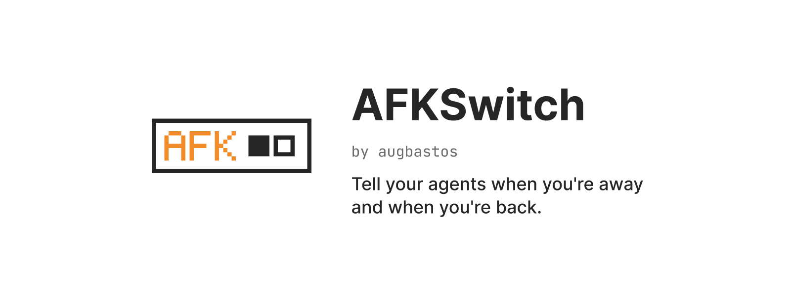
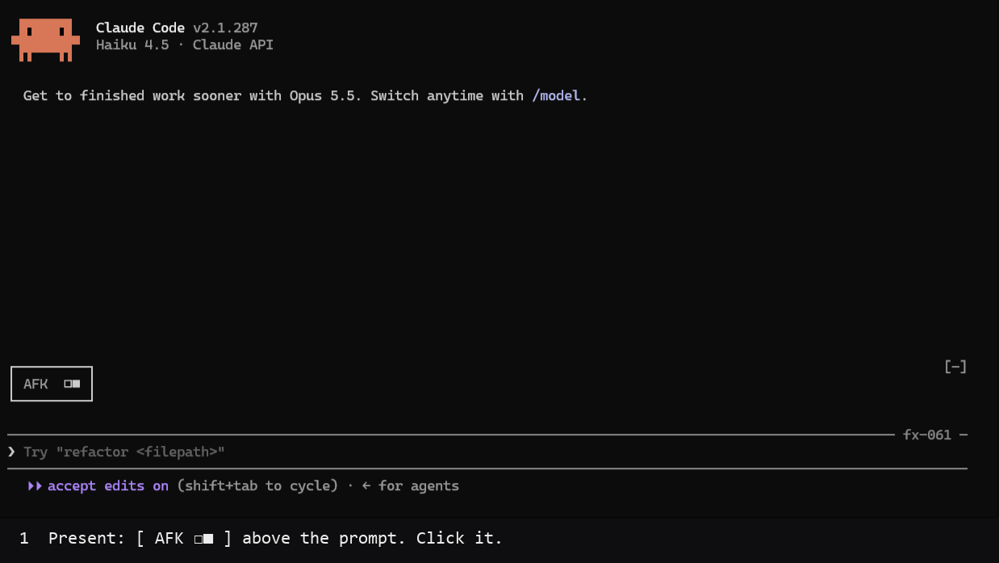

# AFKSwitch

<picture>
  <source media="(prefers-color-scheme: dark)" srcset="assets/readme/hero-dark.png">
  
</picture>

**AFKSwitch by augbastos** — Tell your agents when you're away and when you're back.

Claude Code knows what its agents are doing. AFKSwitch tells them whether you are at the computer.

```text
[ AFK  □■ ]  you're here
[ AFK  ■□ ]  you're away
```



## Install

```text
/plugin marketplace add augbastos/afkswitch
/plugin install afkswitch@afkswitch
/reload-plugins
```

Needs Claude Code 2.1.287+ and `python3` (Python 3.9+); the switch appears above the prompt.
AFKSwitch is a Claude Code Mod.

### Try it in 30 seconds

1. Open two Claude Code sessions in two terminals with AFKSwitch loaded.
2. Click the switch in one session to set AFK.
3. Watch the other session get told and continue its authorized work.
4. Click again to return and collect status.

### Trust

- MIT licensed.
- Presence is stored in a local state file.
- No AFKSwitch server, account, telemetry, or network requests.
- Presence is not permission.
- One writer: the bundled state helper.
- Explicit transitions only: a click or `/afk` / `/back`.


## What it does

```text
/afk [optional context]     I'm physically away
/back [optional context]    I'm physically present again
```

In Claude Code, `/afk` saves your presence and tells the live local sessions the host
can reach; the report names any it could not reach. Authorized work continues, and
only steps that need you wait. `/back` collects a summary with what needs you first,
then what got done. Optional context is information, never permission; `/back` context
belongs to that return event and is not saved in the state file.

The Claude Code terminal switch sits above the prompt:

```text
[ AFK  □■ ]    Present
[ AFK  ■□ ]    Away
[ AFK  □□ ]    Before first use (press to start AFK), or unknown
```

When away, **AFK** is orange (`#F28C28`). The cells move, so the state is readable
without color in monochrome terminals too.

Click it once, or focus it with `ctrl+x tab` and press Enter.
One press = one explicit action: the same `/afk` or `/back` skill, without context.
The switch never flips optimistically: it shows only state confirmed by a fresh read.
Before first use (no state file yet), the neutral switch (`□□`) is pressable and starts AFK.
An unreadable or invalid state stays neutral (`□□`) and cannot be pressed. Double presses are blocked
while an action is pending. One-time onboarding lines explain the switch; `saving…` marks a pending action and `not switched — try /afk or /back` marks a failed or unconfirmed action.
The skill starts a model turn; the host's permissions and costs still apply.

## Requirements

- **Python 3.9+**, available as `python3` on `PATH`, for the state helper and the
  read-only sync hooks. The text skills can also discover `python` or `py -3`, but
  the bundled command hooks call `python3` directly.
- **For the switch:** Claude Code with function-hooks modules. Live-tested on
  **2.1.287**: one click runs `/afk` or `/back`, peers are notified, and each
  session's switch redraws on its next event. See the [compatibility record](docs/compatibility.md).

Marketplace installs from GitHub load the switch on Claude Code 2.1.287+;
module loading was verified on 2026-10-02, tested on one machine.
The Claude plugin directory copy currently ships without the switch
(`v0.6.3-directory`) while the directory reviews mods. Install from GitHub using
the commands above for the switch. If your build does not load installed mods,
use `claude --plugin-dir <clone>` or `CLAUDE_CODE_PLUGIN_DIRS` to load the clone.
The visual switch is supported on the terminal only.

## Three rules

1. **One writer: the helper.** Only the bundled helper saves presence. The switch and
   sync hooks read it; peers are notified only after a successful save and read-back.
2. **Explicit actions only.** Only `/back` ends AFK, including through the switch.
   Time passing, a remote reply, or a session restart never means you returned.
3. **Presence is not permission.** Away does not mean unreachable or authorize new
   actions. Only the step that needs you waits; independent authorized work continues.

## Compatibility

Capabilities from [the adapter matrix](adapters/capabilities.json):

| Host | State | Sync | Notify peers | Collect return status | Visual switch |
|---|---|---|---|---|---|
| Claude Code | yes | yes | yes | yes | terminal, with modules |
| Codex | yes | no | no | no | no |
| Antigravity CLI | yes | no | no | no | no |
| Generic local agent | yes | before each turn, if the host calls the helper | no | no | no |

Claude Code sync runs at session start and prompt submission. Codex and Antigravity
ship experimental hook files, without default wiring or verified live-host sync.
Their peer notification and return-status collection are unsupported. The switch's
installation options are described above; UI tests do not prove live model behavior.
See [tested versions and evidence](docs/compatibility.md) for the verification limits.

## What AFKSwitch reads, writes, and sends

**Privacy:** state stays local in `~/.afkswitch/state.json`, or in `state.json` under
`AFKSWITCH_STATE_DIR` when set. It contains status, time, optional AFK context, and a
change counter. The helper briefly creates a lock while writing and preserves an
unreadable old file as `state.json.corrupt-<time>`.

AFKSwitch runs no server and makes no network requests of its own. Messages between
sessions travel through the host's own mechanisms and are governed by the host.

Read-only sync hooks inspect state and a bounded session transcript tail, then exit.
The switch reads only state. There is no daemon, polling, account, or telemetry.
Claude Code peer messages can include your optional context; host data handling applies.

Read the [Privacy policy](PRIVACY.md) and [Security policy](SECURITY.md).

## Other installation options

### Local clone

```sh
git clone https://github.com/augbastos/afkswitch.git
claude --plugin-dir ./afkswitch
```

### Codex

```text
codex plugin marketplace add https://github.com/augbastos/afkswitch
codex plugin add afkswitch@afkswitch
```

Use `$afkswitch:afk` and `$afkswitch:back`. The state folder must be writable;
see [Codex sandbox setup](docs/details.md#codex-sandbox).

## How it works

The plugin ships `SessionStart` and `UserPromptSubmit` command hooks. They only read
state and the session transcript tail to sync presence; they never write either file.
The switch is a hooks module (`hooks/switch.tsx`). It hooks `session.start`,
`prompt.submit` and `turn.complete` to re-read state and redraw, and `command.run`
only to notice when its own command starts; it passes every event on unchanged
and never edits your prompt. It draws through `ui.render` on
`AbovePrompt`. A press runs `/afkswitch:afk` when present or before first use, or
`/afkswitch:back` when away, once per press and without context.
See the [presence specification](spec/presence.md) for the state contract.

## Links

[Changelog](CHANGELOG.md) · [Details and usage](docs/details.md) ·
[Compatibility](docs/compatibility.md) · [Presence specification](spec/presence.md) ·
[Writing an adapter](adapters/README.md) · [Conformance tests](conformance/README.md) ·
[Support](SUPPORT.md) · [Contributing](CONTRIBUTING.md) · [MIT license](LICENSE)
